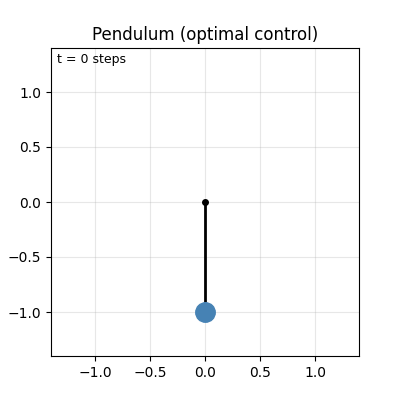

# trexdiff

_A minimal autodiff package written in C._

[](LICENSE)
[](https://github.com/traikodinev/trexdiff/actions/workflows/test.yml)

You are on branch `dev-blas`, which has a BLAS-based implementation of autodiff.
This is the second _dev_ branch of the package, built from `dev-scalar`.

This branch is still under development.

## Examples

- 2D-regression,see [examples/01_regression_gd.ipynb](examples/01_regression_gd.ipynb)
- Neural Net classification [examples/02_nonlinear_classification.ipynb](examples/02_nonlinear_classification.ipynb)
- Pendulum Optimal Control [examples/04_optimal_control_pendulum.ipynb](examples/04_optimal_control_pendulum.ipynb)
- Iterative Linear Quadratic Regulator [examples/05_iterative_linear_quadratic_regulator](examples/05_iterative_linear_quadratic_regulator.ipynb) - using eager evaluation

## Pendulum Optimal Control



```py
# time horizon -> how many timesteps
T = 50

# difference btwn. timesteps
dt = 1e-1

# gravity
g = 9.81

x0 = [
    Node(tensor2d([[0.0]])),
    Node(tensor2d([[0.0]]))
]

def f(x, u, dt):
    """x_t+1 given x_t, u_t"""

    a = u - g * sin(x[0])
    theta_dot_new = x[1] + dt * a
    theta_new = x[0] + theta_dot_new * dt

    # new state
    return [theta_new, theta_dot_new]


xs = [x0]
us = []

for t in range(T):
    u_val = 2.0
    u = Node(tensor2d([[u_val]]))
    us.append(u)

    xs.append(f(xs[-1], u, dt))

# loss
U_LIM = 10
Qf  = 1e4
loss = Qf * (cos(xs[-1][0]) + 1) + Qf * (xs[-1][1] * xs[-1][1])

# control cost
for u in us:
    loss += 1e-1 * u * u
```

### Neural Net Classification

```py
# neural network definition
N_NEURONS = 15

# input nodes
x = Node(tensor2d(xs))
y = Node(tensor2d(ys.reshape(-1, 1)))

ones = Node(tensor2d.ones(ys.shape[0], 1)) # todo: int-to-node
eps = Node(tensor2d([[1e-7]]))

# weights
w0 = Node(tensor2d(np.random.normal(0, 1, size=(2, N_NEURONS))))
w1 = Node(tensor2d(np.random.normal(0, 1, size=(N_NEURONS, 1))))

b0 = Node(tensor2d(np.random.normal(0, 1, size=(1, N_NEURONS))))
b1 = Node(tensor2d(np.random.normal(0, 1, size=(1, 1))))

# network
layer1 = relu(x @ w0 + b0)
logits = layer1 @ w1 + b1
out_sigmoid = sigmoid(logits)

# cross-entropy loss
loss = y.T @ log(out_sigmoid + eps) + (ones - y).T @ log(ones - out_sigmoid + eps)
```

## Build

```sh
make example
make python

# Both
make
```

python:

```sh
make python
pip install -e .
```

## Test

```sh
make test
```

## Current Progress

- [x] tensor2d - basic math w/ BLAS calls
- [x] tensor2d as backend for node
- [ ] python tests
    - [x] framework and tensor matmul test
    - [ ] API correctness test

`Node` and `Tensor2D` should be unified, because they are not very usable:

```py
from trexdiff import tensor2d, Node

x = tensor2d.ones(1, 1)
y = Node(x)
# node now owns `x`

del y
# also deletes x
```

Instead, current WIP is to use an `array` class:

```py
from trexdiff import array
x = array([1,2])

# array acts as both node and tensor2d
```

Other issues:

- [ ] functionals and transpose copy nodes and waste memory
- [ ] Node count is overly pessimistic
- [ ] no cycle detection in graph
- [ ] graph compilation

## Citation

```bibtex
@software{dinev2026trexdiff,
  author  = {Dinev, Traiko},
  title   = {trexdiff: A minimal automatic differentiation library in C},
  year    = {2026},
  url     = {https://github.com/traikodinev/trexdiff},
}
```
